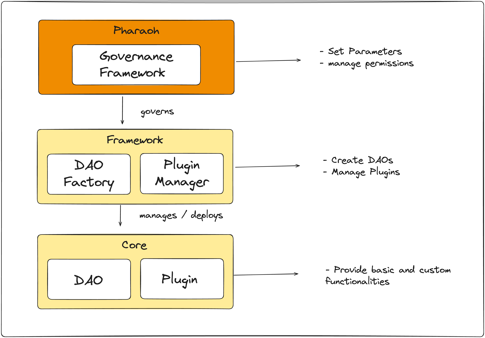

# Pharaoh

## What's inside?

This Turborepo include the following packages/apps:

### Apps and Packages

- `docs`: Documentation for Pharaoh contracts and high level concepts
- `web`: Pharaoh user interface been written in Next.js
- `starknet-contracts`: Pharaoh contracts

## Acknowledgements

- Credits to [Aragon](https://github.com/aragon) for their initial work on [DAO governance framework and OSx](https://github.com/aragon/osx).

## Development

Pharaoh is under active development.

